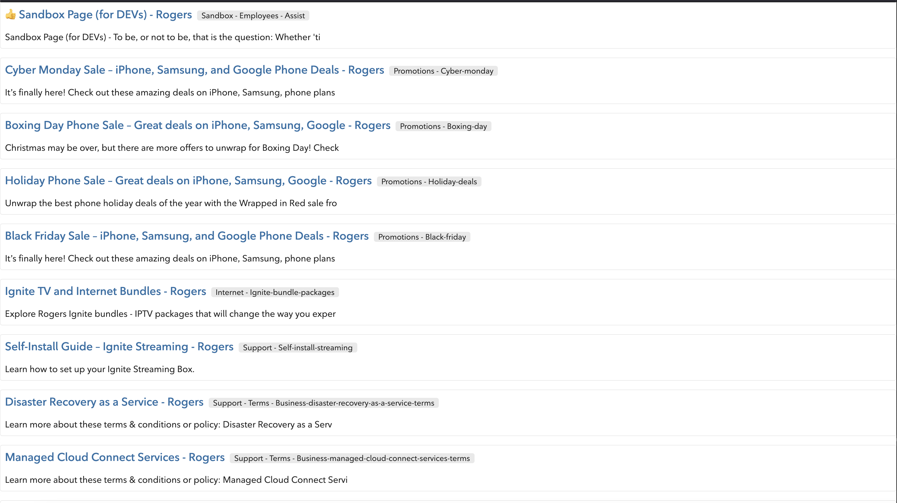

# Test2

[Angular] version 14.2.8.

```
npm install
```

or

```
yarn install
```


1. GraphQL query is in `answer/graphql-query.txt`
    **Note: I remove the error entries using filter

2. Run the below command to generate the JSON file
```
  node answer/query-convert.js
```

3. Here is the result on `ng serve`

    